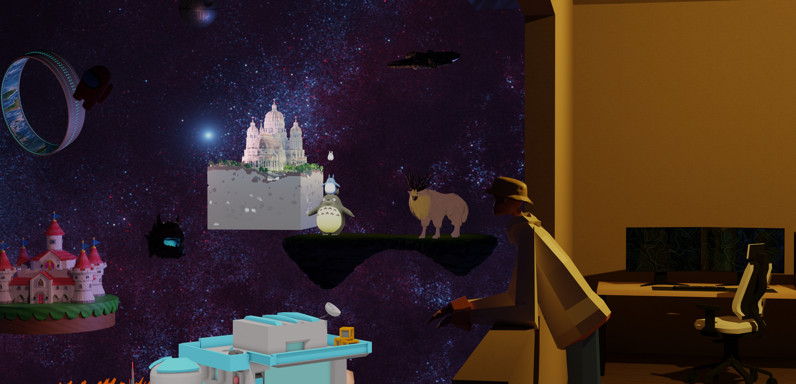

### [Greetings!, I'm Drei Abmab, a web/software/game dev](https://dreiabmab.com/)

I'm a developer with a knack for game dev and web design and have been developing since 2019 Join me on my tech journey! #ITEnthusiast #GameDev #WebDev #SoftwareDev 

[Visit My Website](https://dreiabmab.com/)

## Socials:
    

## GitHub Stats:

  
  

## Languages and Tools:

                                 

<picture>
  <source media="(prefers-color-scheme: dark)" srcset="https://raw.githubusercontent.com/Dreigannadoit/Dreigannadoit/output/github-snake-dark.svg" />
  <source media="(prefers-color-scheme: light)" srcset="https://raw.githubusercontent.com/Dreigannadoit/Dreigannadoit/output/github-snake.svg" />
  
</picture>

##  GitHub Trophies

---

"We are what we repeatedly do. Excellence, then, is not an act, but a habit.” — Aristotle
